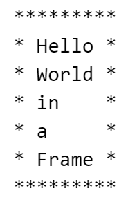

### Problem: Frame Printing

You are writing a program to help design signs for a local community fair. Your program will receive a slogan from each participant and needs to be able to transform the sentence into the desired format so it can be neatly fit onto a sign that follows the fair's specifications.

The fair's specifications are as follows:
* Each sign must have a top and a bottom border.
* Each sign must have exactly one word per line, save for the border lines which must not have any words.
* Each sign must be wide enough for every word to fit properly within its borders, with at least one space on either side of each word.

For example, the slogan `"Hellow World in a Frame"` would be displayed as:

Use the function below to get started.

When you're ready to test, please run: `python grader.py` or `python3 grader.py`, depending on your system.

(for tool group only):
This problem is supported by a tool we've been developing in my lab.

This tool aims to help you figure out a good structure for your solution and help you pinpoint the reason behind certain errors. When you submit your code, some recommendations from the tool will be included in your output.